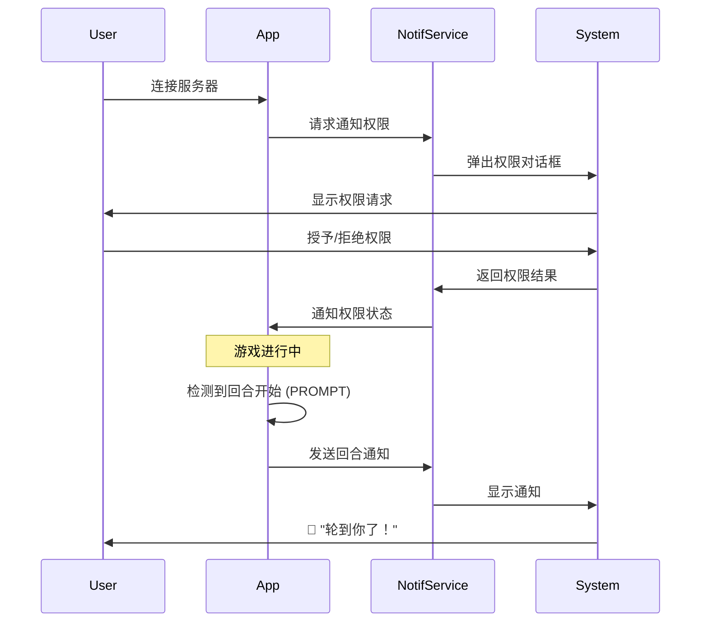

# 移动端推送通知功能

## 概述

LB_FATE Mobile 现在支持回合通知功能，当轮到玩家回合时会自动发送本地推送通知提醒。

## 功能特性

### ✅ 自动通知
- **回合提醒**：轮到玩家回合时自动发送通知
- **权限请求**：首次连接时自动请求通知权限
- **跨平台支持**：Android、iOS、Windows 均支持

### 📱 平台支持

#### Android
- ✅ 支持 Android 5.0+ (API 21+)
- ✅ Android 13+ (API 33+) 需要 POST_NOTIFICATIONS 权限
- ✅ 通知渠道：lbfate_game
- ✅ 优先级：高（High）
- ✅ 支持振动和唤醒

#### iOS
- ✅ 支持 iOS 15.0+
- ✅ 前台通知显示
- ✅ 自动请求通知权限

#### Windows
- ✅ 支持 Windows 10.0.17763+
- ✅ 使用 Microsoft.Toolkit.Uwp.Notifications

## 实现细节

### 核心组件

#### 1. NotificationService.cs
```csharp
public class NotificationService
{
    public bool NotificationsEnabled { get; set; }
    public Task<bool> RequestPermissionAsync()
    public Task SendTurnNotificationAsync()
    public void ClearAllNotifications()
    public void ClearTurnNotification()
}
```

**功能**：
- 管理通知权限
- 发送回合通知
- 清除通知

#### 2. Android 权限配置
文件：`Platforms/Android/AndroidManifest.xml`

```xml
<uses-permission android:name="android.permission.POST_NOTIFICATIONS" />
<uses-permission android:name="android.permission.VIBRATE" />
<uses-permission android:name="android.permission.WAKE_LOCK" />
```

#### 3. MauiProgram.cs 初始化
```csharp
builder
    .UseMauiApp<App>()
    .UseLocalNotification()  // 初始化通知插件
```

#### 4. GameViewModel 集成
```csharp
public GameViewModel(NotificationService notificationService)
{
    _notificationService = notificationService;
    // ...
}

private void OnTurnStarted()
{
    GameState.IsMyTurn = true;
    _ = SendTurnNotificationAsync();
}
```

## 通知流程



## 通知内容

### 标题
```
轮到你了！
```

### 描述
```
现在是你的回合，快来操作吧！
```

### 通知属性
- **ID**: 1001 (固定)
- **BadgeNumber**: 1
- **CategoryType**: Status
- **Android Priority**: High
- **iOS HideForegroundAlert**: false

## 用户体验

### 首次使用
1. 用户连接服务器
2. 应用自动请求通知权限
3. 系统弹出权限对话框
4. 用户授予权限
5. 显示消息："已启用回合通知提醒"

### 游戏中
1. 轮到玩家回合时
2. 服务器发送 `PROMPT` 消息
3. 应用触发 `OnTurnStarted` 事件
4. 自动发送本地通知
5. 用户收到通知提醒

### 权限被拒绝
- 显示消息："未启用通知权限，你将无法收到回合提醒"
- 游戏仍可正常进行，只是没有通知

## API 使用示例

### 启用/禁用通知
```csharp
// 在 NotificationService 实例中
notificationService.NotificationsEnabled = false;  // 禁用通知
notificationService.NotificationsEnabled = true;   // 启用通知
```

### 手动发送通知
```csharp
await notificationService.SendTurnNotificationAsync();
```

### 清除通知
```csharp
// 清除回合通知
notificationService.ClearTurnNotification();

// 清除所有通知
notificationService.ClearAllNotifications();
```

## 依赖项

### NuGet 包
- `Plugin.LocalNotification` v12.0.0
  - 跨平台本地通知插件
  - 支持 Android、iOS、Windows

### 相关依赖
- `Microsoft.Toolkit.Uwp.Notifications` (Windows)
- `Xamarin.GooglePlayServices.Location` (Android)
- 各种 AndroidX 库

## 配置选项

### 自定义通知渠道（Android）
在 `NotificationService.cs` 中修改：
```csharp
ChannelId = "lbfate_game"  // 自定义渠道 ID
```

### 自定义通知 ID
```csharp
private const int TurnNotificationId = 1001;  // 修改此值
```

### 自定义通知内容
```csharp
var notification = new NotificationRequest
{
    Title = "自定义标题",
    Description = "自定义描述",
    // ...
};
```

## 故障排除

### Android 13+ 无法显示通知
**原因**：未授予 POST_NOTIFICATIONS 权限

**解决方案**：
1. 检查 AndroidManifest.xml 是否包含权限声明
2. 在设置中手动授予应用通知权限
3. 重启应用

### iOS 不显示通知
**原因**：可能被系统限制或用户禁用

**解决方案**：
1. 检查 iOS 设置 → 通知 → LB_FATE
2. 确保"允许通知"已开启
3. 检查通知样式设置

### Windows 通知不工作
**原因**：Windows 通知服务未启动

**解决方案**：
1. 检查 Windows 通知设置
2. 确保"获取来自应用和其他发送者的通知"已开启
3. 检查应用通知权限

## 安全性考虑

### 权限最小化
- 仅请求必要的通知权限
- 不收集用户数据
- 本地通知，无服务器通信

### 用户控制
- 用户可随时在系统设置中禁用通知
- 应用提供启用/禁用选项

## 未来改进

### 计划功能
- [ ] 可自定义通知声音
- [ ] 通知历史记录
- [ ] 多种通知类型（游戏结束、好友邀请等）
- [ ] 通知延迟设置
- [ ] 免打扰模式

### 性能优化
- [ ] 减少通知频率限制
- [ ] 智能通知（根据用户习惯）
- [ ] 电池优化（降低后台唤醒）

## 相关文件

- `LB_FATE.Mobile/Services/NotificationService.cs` - 通知服务核心
- `LB_FATE.Mobile/ViewModels/GameViewModel.cs` - 通知触发逻辑
- `LB_FATE.Mobile/MauiProgram.cs` - 插件初始化
- `LB_FATE.Mobile/Platforms/Android/AndroidManifest.xml` - Android 权限配置

## 参考文档

- [Plugin.LocalNotification 官方文档](https://github.com/thudugala/Plugin.LocalNotification)
- [MAUI 通知最佳实践](https://learn.microsoft.com/en-us/dotnet/maui/)
- [Android 通知指南](https://developer.android.com/develop/ui/views/notifications)
- [iOS 通知指南](https://developer.apple.com/documentation/usernotifications)

---

**文档版本**: 1.0
**最后更新**: 2025-10-01
**作者**: Claude Code
